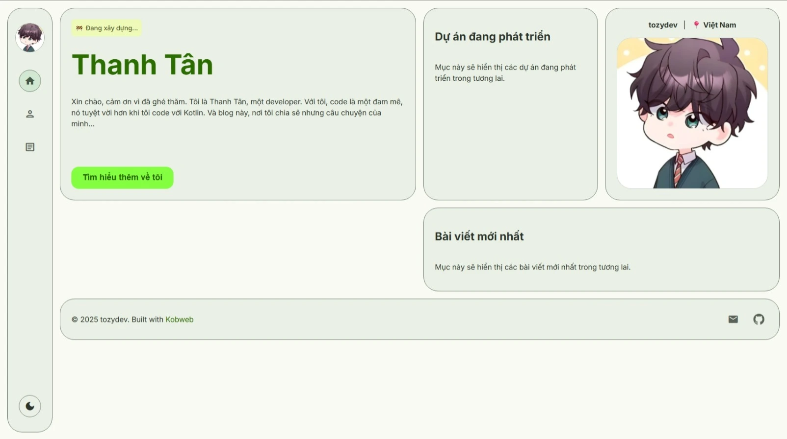
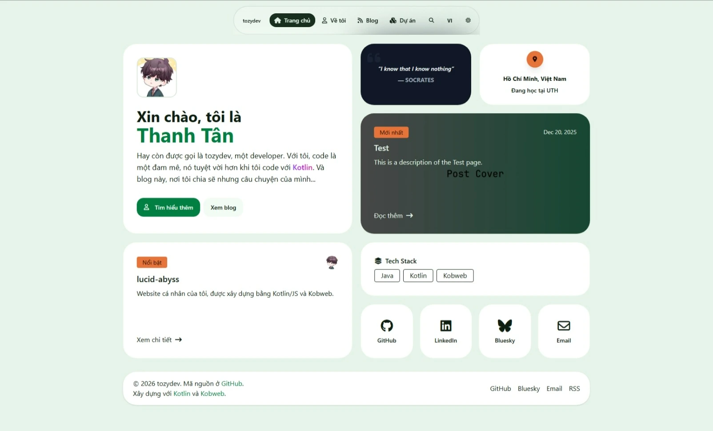

Tôi xây dựng website bằng Kotlin thay vì Javascript, và mất tận bốn tháng miệt mài tìm tòi, nghiên cứu, cuối cùng tôi
cũng go live được website của mình. Trong quá trình phát triển, tôi đã tìm ra nhiều điều mới mẻ, nhưng cũng mang lại
nhiều thử thách cho tôi. Tôi sẽ kể cho các bạn nghe về quá trình đó trong bài viết này.

## Website Của tozydev

Website này là dự án nghiêm túc đầu tiên của tôi, cũng là dự án thỏa niềm đam mê của mình, sử dụng Kotlin và duy trì nó
lâu dài cho dự án thực tế.

Website được viết bằng ngôn ngữ Kotlin, sử dụng framework Kobweb và Tailwind CSS. Kobweb là một web framework được xây
dựng trên Compose HTML. Nếu bạn là một Android developer thì có lẽ bạn sẽ biết Jetpack Compose, Compose HTML có phong
cách viết cũng tương tự như vậy nhưng được sử dụng để viết HTML. Nền tảng Kotlin sử dụng ở website này là Kotlin/JS, nhờ
đó mà tôi có thể tận dụng hệ sinh thái rộng lớn của Javascript, điển hình như webpack, Tailwind CSS, Shiki, Pagefind.

Website này được sử dụng để "flex" về bản thân tôi, cũng như chia sẻ các câu chuyện, bài học, kinh nghiệm trong quá
trình phát triển sự nghiệp và bản thân. Tôi mong rằng những chia sẻ đó sẽ hữu ích với bạn.

## Tại Sao Lại Chọn Kotlin Và Kobweb?

Kobweb là một Kotlin web framework tuyệt vời. Nó có hầu như các công cụ cần thiết giúp tôi xây dựng website bằng Kotlin.
Kobweb có các tính năng tích hợp sẵn ngay từ đầu: page routing, page layout, page metadata, hỗ trợ markdown, xuất site
tĩnh,... Kobweb cũng đã tận dụng tốt Compose HTML để giúp xây dựng web một cách trực quan và dễ bảo trì. Nếu sử dụng
Compose HTML khi không có Kobweb, bạn sẽ phải thiết lập rất nhiều thứ rắc rối. Nhờ có Kobweb mà các việc đó đã giảm đi
rất nhiều.

Ngoài Kobweb cũng còn rất nhiều lựa chọn khác, tối ưu và thích hợp nhất là sử dụng Javascript và các framework
Javascript như Astro, React, Next.js,... Nhưng tôi lại không chọn Javascript, tôi muốn sử dụng Kotlin. Kotlin là ngôn
ngữ lập trình yêu thích nhất của tôi và còn gì ý nghĩa hơn sử dụng nó cho chính trang web của mình. Hơn nữa tôi muốn thử
một hướng đi ít phổ biến hơn thay vì hệ sinh thái Javascript quen thuộc.

Còn nói đến hệ sinh thái Kotlin web thì cũng còn nhiều lựa chọn lắm, điển hình như Kotlin React, Compose Multiplatform,
Kilua, Kvison,... Nhưng các framework này đòi hỏi phải thiết lập nhiều thứ, chưa có nhiều tính năng tích hợp sẵn. Và thứ
tôi quyết định chọn Kobweb là tính năng xuất site tĩnh của nó. Nhờ đó website của tôi có thể tối ưu hiệu năng hơn rất
nhiều so.

## Khó Khăn Trong Quá Trình Phát Triển

Trong quá trình phát triển website, tôi cũng gặp nhiều cái khó dù website rất đơn giản. Nếu sử dụng Javascript, có lẽ
vài ngày, chậm nhất cũng một tuần là hoàn thành website rồi. Nhưng khi sử dụng Kotlin và Kobweb, việc phát triển lại tốn
thời gian hơn nhiều. Hệ sinh thái Kotlin web còn trong giai đoạn đầu phát triển, chưa có nhiều thư viện và cộng đồng hỗ
trợ mạnh mẽ. Các công việc tích hợp các thư viện Javascript hoặc thêm các tính năng cần phải tự nghiên cứu và áp dụng.
Một tính năng đơn giản thôi cũng mất cả buổi để tích hợp vào vì phải thử áp dụng nhiều cách khác nhau. Tuy có AI hỗ trợ,
nhưng cũng vì lý do hệ sinh thái còn mới mẻ (hoặc do skill issue) nên AI cũng chẳng giúp được bao nhiêu cả (về
Kotlin/JS). Còn về giao diện và bố cục thì AI đã giúp tôi rất nhiều.

Bên cạnh đó, quá trình này tốn thời gian vì tôi "đập đi xây lại" nhiều lần, ít nhất cũng phải ba lần ấy. Lần đầu tiên
tôi sử dụng Kotlin với Kobweb và Silk, một UI layer tích hợp sẵn trong Kobweb. Nhưng tôi chẳng phải là frontend
developer nên thiết kế và triển khai UI cực xấu. Tôi lại chuyển sang sử dụng Kotlin, Kobweb, Tailwind CSS và Daisy UI.
Lần này tôi sử dụng phong cách thiết kế bento grid (sắp xếp các widget có hình vuông hoặc chữ nhật nằm cạnh nhau) và bo
cực tròn, nói chung nhìn rất màu mè và lòe loẹt. Và lần cuối cùng này, tôi bỏ Daisy UI, chỉ sử dụng Kotlin, Kobweb và
Tailwind CSS cùng với hệ thống màu của Material 3. Lần này website cũng mềm mại và đơn giản hơn bản trước, tuy vẫn còn
màu mè lắm, nhưng đối với tôi như vậy là ok rồi.

## Kết

Website này là dự án đầy tâm huyết của tôi, sử dụng ngôn ngữ yêu thích để xây dựng nên website. Trong quá trình phát
triển, cùng với niềm đam mê khám phá những điều mới, nó đã đem lại cho tôi nhiều thử thách và trải nghiệm tuyệt vời. Dù
mất nhiều thời gian hơn tôi nghĩ, nhưng có lẽ đó cũng là điều dự án này trở nên đáng nhớ đối với tôi. Tuy hệ sinh thái
Kotlin trên web còn khá mới mẻ, tôi mong rằng trong tương lai sẽ phát triển và mở rộng nhiều hơn nữa.

Cảm ơn bạn đã xem bài viết này! Hẹn gặp lại!

<i>*Ảnh bìa được tạo bởi AI, cụ thể là ChatGPT Images 2.0, với prompt: "vast sky horizon, manhwa style, soft clouds, atmospheric lighting, dreamy sunset, cinematic composition, minimal landscape, elegant color palette, artistic and calm mood, no people"
</i>

