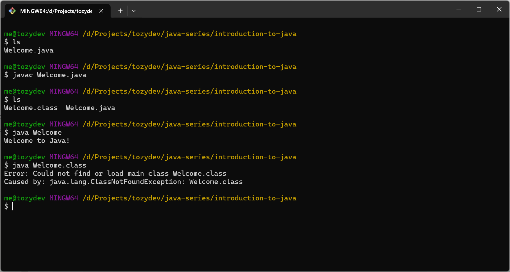
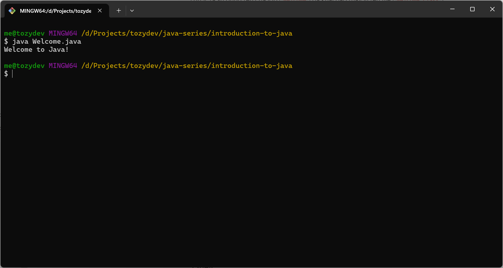

Java là một ngôn ngữ lập trình hướng đối tượng (object-oriented programming) bậc cao, dựa trên lớp (class-based). Cú
pháp của Java tương tự như C/C++. Java không chỉ là một ngôn ngữ lập trình, nó là một nền tảng cho phép các nhà phát
triển có thể phát triển các ứng dụng với nhiều mục đích khác nhau như: web, desktop app, mobile app, embedded,…

Java được thiết kế và phát triển bởi James Gosling tại Sun Microsystems năm 1995, sau được Oracle mua lại và năm 2009.
Ban đầu, Java có mã nguồn đóng và có giấy phép. Kể từ năm 2007, Sun đã cấp phép mã nguồn mở cho Java.

Trước đây, thời gian phát hành phiên bản mới của Java không theo quy tắc. Từ năm 2018, phiên bản mới sẽ được phát hành
mỗi 6 tháng. Các phiên bản LTS (long-term support), các phiên bản ổn định và được hỗ trợ cập nhật bảo mật dài hơn nhiều
so với các phiên bản khác, bao gồm Java 8, Java 11, Java 17, Java 21 và sắp tới là Java 25 (dự kiến).

| Phiên bản | Năm  | Tính năng mới                                                                                                     |
| --------- | ---- | ----------------------------------------------------------------------------------------------------------------- |
| 1.0       | 1996 | Phiên bản đầu tiên                                                                                                |
| 1.1       | 1997 | Inner classes, JDBC (Java Database Connectivity), JavaBeans, RMI (Java remote method invocation) và serialization |
| 1.2       | 1998 | `strictfp` modifier, collections framework                                                                        |
| 1.3       | 2000 | Không có                                                                                                          |
| 1.4       | 2002 | Assertions                                                                                                        |
| 5.0       | 2004 | Generics, metadata, autoboxing, enumerations, varargs, for-each loop, static imports                              |
| 6         | 2006 | Không có                                                                                                          |
| 7         | 2011 | NIO (new I/O library), diamond operator, try-with-resources                                                       |
| 8 (LTS)   | 2014 | Lambda expression, interfaces with default methods, stream and date/time library                                  |
| 9         | 2017 | Modules (Project Jigsaw)                                                                                          |
| 11 (LTS)  | 2018 | `var`, HTTP client, removal of JavaFX                                                                             |
| 17 (LTS)  | 2021 | Switch expression, text blocks, `instanceof` pattern matching, records, sealed classes                            |
| 21 (LTS)  | 2023 | Virtual thread, pattern matching                                                                                  |

## Java Programming Environment

Chương trình Java, thay vì phiên dịch (compile) trực tiếp ra mã máy mà phiên dịch ra Java bytecode, được trên máy ảo
Java (JVM hay Java Virtual Machine). Để có thể khởi chạy chương trình Java, ta cần cài đặt JDK (Java Development Kit).

### JDK

Hiện tại, có rất nhiều bản phát hành của JDK, mỗi bản này đều dựa trên Java Language Specification và OpenJDK. Nếu mới
bắt đầu, bạn có thể tải [Temurin JDK](https://adoptium.net/temurin/releases/) của Eclipse. Chọn phiên bản Java 21 LTS
mới nhất. Bạn có thể tham khảo hướng dẫn cài đặt chính thức tại đây: https://adoptium.net/installation/

Sau khi cài đặt xong, hãy khởi động lại terminal và nhập dòng lệnh sau

```bash
javac --version
```

và nhấn Enter. Bạn sẽ nhận được dòng như sau là cài đặt thành công

```bash
javac 21.0.5
```

### Command-Line

Trước tiên, hãy bắt đầu làm quen việc biên dịch và chạy chương trình Java bằng dòng lệnh. Mặc dù thực tế ta sẽ không cần
sử dụng dòng lệnh nhưng biết thêm một ít chẳng sao nhỉ?

Hãy tạo một file tên `Welcome.java`, sao chép và dán đoạn mã sau

```java
public class Welcome {
    static void main(String[] args) {
        System.out.println("Welcome to Java!");
    }
}
```

Hiện tại bạn chưa cần hiểu cách nó hoạt động như thế nào.

Hãy mở Terminal lên và thực hiện lệnh

```bash
javac Welcome.java
```

Lệnh này sẽ biên dịch `Welcome.java` thành file `Welcome.class` dùng để thực thi trên máy ảo Java.

Để chạy chương trình, ta sử dụng lệnh

```bash
java Welcome
```

Lưu ý, ta sử dụng tên của lớp (`Welcome`) đã khai báo thay vì tên file (`Welcome.class`).



Ở phiên bản Java mới này, bạn có thể chạy trực tiếp chương trình Java mà không cần biên dịch (giống như script)

```bash
java Welcome.java
```



## Kết luận

Ngày này, mọi người tranh nào bàn luận liệu Java có lỗi thời hay không? Đối với mình, Java không lỗi thời, ít nhất là
trong vài thập kỉ tới. Còn rất nhiều doanh nghiệp lớn sử dụng Java trong tech stack của họ, như Netflix, Airbnb,... Một
số framework, software viết bằng Java rất mạnh mẽ, dễ dàng triển khai các ứng dụng doanh nghiệp, như Spring Framework,
Kafka, Cassandra,…

Java, không chỉ là ngôn ngữ, mà còn là một nền tảng mạnh mẽ. Trong tương lai, Java sẽ được cập nhật, thêm các tính năng
mới và ngày càng phát triển.

## Tham khảo

https://horstmann.com/corejava/

https://vi.wikipedia.org/wiki/Java_(ng%C3%B4n_ng%E1%BB%AF_l%E1%BA%ADp_tr%C3%ACnh)

[Big Companies That Code in Java: 11 Success Stories | Terenbro](https://terenbro.com/blog/11-large-companies-that-use-java)
