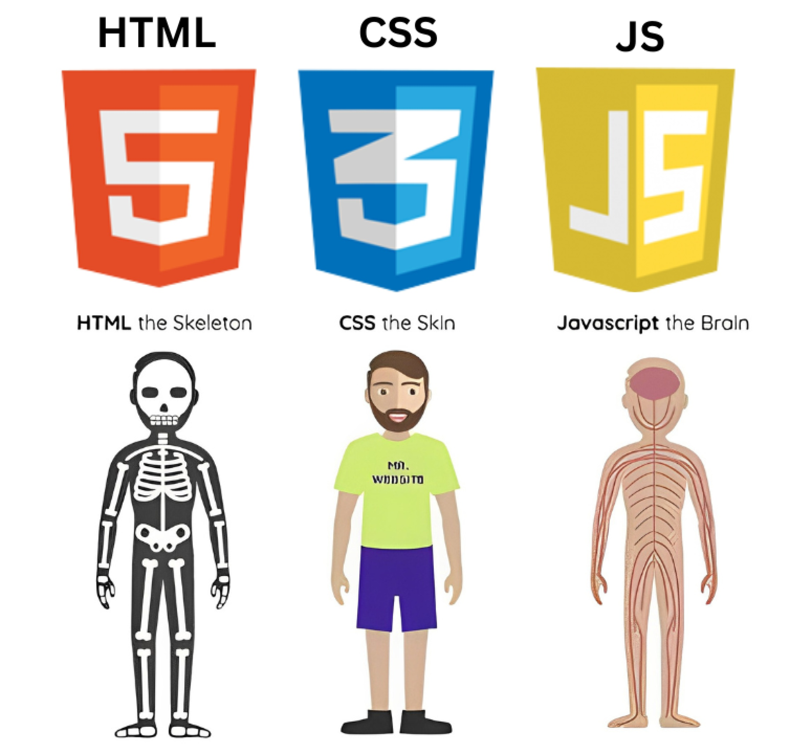

## I. Giới Thiệu về HTML5

**HTML (HyperText Markup Language)** là ngôn ngữ đánh dấu cơ bản, đóng vai trò nền tảng trong việc xây dựng và cấu trúc
nội dung trên internet. Nó được xem là xương sống của mọi trang web, định nghĩa cách các thành phần như văn bản, hình
ảnh, video và các yếu tố đa phương tiện khác được tổ chức và hiển thị trong trình duyệt web. HTML bao gồm một chuỗi
các "phần tử" (elements), được bao bọc bởi "thẻ" (tags), được sử dụng để đánh dấu hoặc gói gọn các phần nội dung khác
nhau để chúng hiển thị hoặc hoạt động theo một cách cụ thể. Các thẻ này cho phép trình duyệt diễn giải nội dung một cách
mạch lạc, xác định các thành phần như tiêu đề, đoạn văn, hình ảnh, hoặc bảng biểu.

Việc hình dung HTML như "khung xương" của một trang web là một cách tiếp cận hữu ích để hiểu vai trò nền tảng của nó.
Giống như một khung xương cung cấp cấu trúc cơ bản cho cơ thể, HTML thiết lập bố cục và thứ tự logic của nội dung mà
không cần quan tâm đến kiểu dáng hay tính tương tác. Sự nhấn mạnh vào việc tổ chức nội dung một cách có ý nghĩa ngay từ
đầu là điều kiện tiên quyết để xây dựng một trang web vững chắc, dễ quản lý và có khả năng mở rộng. Một cấu trúc HTML
được thiết kế tốt sẽ là nền tảng vững chắc cho việc áp dụng các lớp kiểu dáng (CSS) và hành vi động (JavaScript) sau
này, đảm bảo rằng trang web không chỉ trông đẹp mà còn hoạt động hiệu quả và dễ tiếp cận.

### Sự phát triển của HTML và những cải tiến chính trong HTML5

HTML được Tim Berners-Lee tạo ra vào năm 1991. Phiên bản HTML 1.0 ban đầu có chức năng rất hạn chế. Đến năm 1995, HTML
2.0 trở thành phiên bản chuẩn hóa đầu tiên, đặt nền móng cho sự phát triển web hiện đại. Tuy nhiên, bước nhảy vọt đáng
kể nhất là với HTML5. HTML5, phiên bản thứ 5 của ngôn ngữ này, đã chuyển đổi HTML từ một ngôn ngữ đánh dấu đơn giản để
cấu trúc tài liệu thành một nền tảng phát triển ứng dụng web đầy đủ.

Sự phát triển này mang lại nhiều cải tiến quan trọng. HTML5 cho phép nhúng trực tiếp các nội dung đa phương tiện như
video và âm thanh mà không cần các plugin bên ngoài như Flash, điều này giúp cải thiện hiệu suất và khả năng tương thích
trên nhiều thiết bị. Ngoài ra, HTML5 còn giới thiệu nhiều phần tử ngữ nghĩa mới và các API JavaScript mạnh mẽ để tăng
cường khả năng lưu trữ cục bộ, xử lý đa phương tiện và truy cập phần cứng của thiết bị. Sự chuyển đổi này cho phép các
nhà phát triển xây dựng các ứng dụng web phức tạp, giàu tính năng mà trước đây chỉ có thể thực hiện được với các công
nghệ phía máy chủ hoặc plugin độc quyền. Việc hiểu rõ và tận dụng các tính năng mới này của HTML5 là rất quan trọng để
tạo ra các trải nghiệm web hiện đại, không chỉ dừng lại ở các trang web tĩnh đơn thuần.

### Mối quan hệ tương hỗ giữa HTML, CSS và JavaScript trong việc xây dựng trải nghiệm web

Khi một trình duyệt tải một trang web, nó xử lý ba công nghệ cốt lõi hoạt động cùng nhau để tạo ra trải nghiệm mà người
dùng nhìn thấy và tương tác: HTML, CSS và JavaScript. Mỗi công nghệ có một vai trò riêng biệt nhưng bổ trợ lẫn nhau,
tuân thủ nguyên tắc "tách biệt các mối quan tâm" (Separation of Concerns).

- **HTML** (HyperText Markup Language) chịu trách nhiệm cung cấp cấu trúc và nội dung cho trang web. Nó định nghĩa các
  khối xây dựng cơ bản như tiêu đề, đoạn văn, hình ảnh, liên kết, biểu mẫu và danh sách, tổ chức thông tin một cách
  logic.
- **CSS** (Cascading Style Sheets) kiểm soát giao diện và bố cục của các phần tử HTML. Nó xác định cách trang web hiển
  thị, bao gồm màu sắc, phông chữ, khoảng cách, bố cục, hoạt ảnh và thiết kế đáp ứng (cách trang thích ứng với các kích
  thước màn hình khác nhau). CSS cho phép các nhà phát triển tạo ra các thiết kế trực quan hấp dẫn và nhất quán trên
  toàn bộ trang web.
- **JavaScript** mang lại tính tương tác và chức năng động cho các trang web. Nó cho phép trang phản hồi các hành động
  của người dùng, cập nhật nội dung mà không cần tải lại trang, tạo hoạt ảnh và chuyển tiếp, xác thực biểu mẫu, và thực
  hiện các cuộc gọi API để lấy dữ liệu từ máy chủ.

Để dễ hình dung, có thể ví một trang web như một nhà hàng. HTML là cấu trúc và bố cục của nhà hàng (tường, sàn, bàn
ghế). CSS là thiết kế nội thất (màu sắc sơn, kiểu dáng bàn ghế, trang trí, ánh sáng). Cuối cùng, JavaScript là các đầu
bếp và nhân viên phục vụ, những người mang lại sự sống động và tương tác cho trải nghiệm ăn uống (nhận đơn hàng, chuẩn
bị món ăn, phục vụ khách hàng, xử lý thanh toán).



Việc tuân thủ nguyên tắc tách biệt các mối quan tâm không chỉ làm cho mã nguồn sạch sẽ, dễ đọc và dễ bảo trì hơn mà còn
tối ưu hóa hiệu suất tải trang. Trình duyệt có thể xử lý các tệp HTML, CSS và JavaScript theo một thứ tự cụ thể (phân
tích HTML để xây dựng DOM, sau đó áp dụng kiểu CSS, và cuối cùng thực thi JavaScript). Điều này cho phép trình duyệt
hiển thị nội dung cơ bản nhanh chóng trong khi tải và xử lý các tài nguyên khác, cải thiện trải nghiệm người dùng. Hơn
nữa, nguyên tắc này cũng là nền tảng cho sự cộng tác hiệu quả trong các dự án phát triển web lớn, nơi các chuyên gia
khác nhau có thể tập trung vào các khía cạnh cụ thể mà không làm ảnh hưởng đến công việc của người khác.

## II. Các Khái Niệm Cơ Bản trong HTML

### Cấu trúc tài liệu HTML: `<!DOCTYPE html>`, `<html>`, `<head>`, `<body>`

Mỗi tài liệu HTML được cấu trúc một cách cụ thể để trình duyệt có thể diễn giải và hiển thị nội dung một cách chính xác.
Cấu trúc cơ bản này bao gồm một số phần tử cốt lõi:

- **`<!DOCTYPE html>`**: Đây là khai báo kiểu tài liệu, luôn được đặt ở đầu tiên trong mọi tài liệu HTML. Nó thông báo
  cho trình duyệt biết rằng tài liệu này là HTML5, đảm bảo trình duyệt hiển thị trang ở chế độ chuẩn (standards mode)
  thay vì chế độ tương thích ngược (quirks mode). Việc này là tối quan trọng để đảm bảo tính tương thích và hiển thị
  nhất quán trên các trình duyệt khác nhau.
- **`<html>`**: Là phần tử gốc, bao bọc toàn bộ nội dung của trang web. Nó chứa tất cả các phần tử HTML khác, bao gồm cả
  `<head>` và `<body>`. Việc đặt thuộc tính

  `lang="vi"` trong thẻ `<html>` là một thực hành tốt, giúp công cụ tìm kiếm và trình đọc màn hình hiểu ngôn ngữ chính
  của tài liệu, cải thiện khả năng tiếp cận và SEO.

- **`<head>`**: Phần tử này đóng vai trò là một vùng chứa cho các siêu dữ liệu (metadata) về trang web, tức là thông tin
  không hiển thị trực tiếp trên trang cho người dùng. Các thông tin trong

  `<head>` bao gồm:

  - **`<meta charset="UTF-8">`**: Một phần tử `meta` quan trọng chỉ định bộ mã hóa ký tự cho tài liệu là UTF-8. UTF-8
    hỗ trợ hầu hết các ký tự từ các ngôn ngữ viết của con người, đảm bảo rằng trang web của bạn có thể hiển thị chính
    xác mọi nội dung văn bản, tránh các lỗi hiển thị ký tự. Đây là một yếu tố nhỏ nhưng có tác động lớn đến khả năng
    tiếp cận toàn cầu của trang web.
  - **`<meta name="viewport" content="width=device-width, initial-scale=1.0">`**: Phần tử `meta` này là cần thiết cho
    thiết kế đáp ứng (responsive design), hướng dẫn trình duyệt cách kiểm soát kích thước và tỷ lệ của khung nhìn trên
    các thiết bị khác nhau, đảm bảo trang web hiển thị tốt trên cả máy tính để bàn, máy tính bảng và điện thoại thông
    minh.
  - **`<title>`**: Đặt tiêu đề của trang, hiển thị trên tab trình duyệt hoặc thanh tiêu đề của cửa sổ trình duyệt.
    Tiêu đề này cũng được sử dụng khi người dùng đánh dấu trang (bookmark) hoặc khi trang xuất hiện trong kết quả tìm
    kiếm.
  - **`<link rel="stylesheet" href="style.css">`**: Liên kết tài liệu HTML với một tệp CSS bên ngoài để định kiểu cho
    trang.

- **`<body>`**: Phần tử này chứa tất cả nội dung thực tế sẽ được hiển thị trên trang web cho người dùng. Điều này bao
  gồm văn bản, hình ảnh, video, biểu mẫu, và bất kỳ yếu tố tương tác nào khác.

**Ví dụ về cấu trúc HTML cơ bản:**

```html
<!DOCTYPE html>
<html lang="vi">
  <head>
    <meta charset="UTF-8" />
    <meta name="viewport" content="width=device-width, initial-scale=1.0" />
    <title>Báo Cáo Chuyên Sâu về HTML5</title>
    <link rel="stylesheet" href="style.css" />
  </head>
  <body>
    <header>
      <h1>Chào mừng bạn đến với Báo Cáo Chuyên Sâu về HTML5</h1>
    </header>
    <main>
      <p>Đây là một đoạn văn bản giới thiệu về các khái niệm cơ bản của HTML.</p>
    </main>
    <footer>
      <p>&copy; 2024. Bản quyền thuộc về Báo Cáo Chuyên Sâu về HTML5.</p>
    </footer>
  </body>
</html>
```

### Thẻ (Tags), Phần tử (Elements) và Thuộc tính (Attributes): Định nghĩa và cách sử dụng

Trong HTML, việc hiểu rõ sự khác biệt và mối quan hệ giữa thẻ, phần tử và thuộc tính là rất quan trọng để viết mã chính
xác và hiệu quả.

- **Thẻ (Tags)**: Là các từ khóa được bao quanh bởi dấu ngoặc nhọn (`<` và `>`), ví dụ như `<p>` hoặc ``. Thẻ là cú
  pháp được sử dụng để tạo ra một phần tử HTML. Hầu hết các thẻ đi theo cặp: một thẻ mở (ví dụ:

  `<p>`) và một thẻ đóng (ví dụ: `</p>`), trong đó thẻ đóng có dấu gạch chéo (`/`) trước tên thẻ. Tuy nhiên, có một số
  thẻ tự đóng (còn gọi là void elements) không cần thẻ đóng vì chúng không bao gồm nội dung, ví dụ như

  ``, `<hr/>`, `<br/>`. Theo quy ước và thực hành tốt, tên thẻ nên được viết bằng chữ thường, mặc dù HTML không
  phân biệt chữ hoa chữ thường.

- **Phần tử (Elements)**: Một phần tử HTML là một đơn vị cấu trúc hoàn chỉnh trong tài liệu HTML. Nó bao gồm thẻ mở, nội
  dung (nếu có), và thẻ đóng. Ví dụ, trong

  `<p>Đây là nội dung đoạn văn.</p>`, toàn bộ cấu trúc từ thẻ `<p>` mở đến thẻ `</p>` đóng, bao gồm cả văn bản bên
  trong, tạo thành một phần tử đoạn văn. Việc phân biệt giữa thẻ (cú pháp) và phần tử (đơn vị cấu trúc hoàn chỉnh) là
  rất quan trọng. Thẻ là công cụ để tạo ra phần tử, còn phần tử là đơn vị mà trình duyệt xây dựng thành Cây DOM (
  Document Object Model), nơi CSS và JavaScript tương tác với nội dung.

- **Thuộc tính (Attributes)**: Cung cấp thông tin bổ sung hoặc tùy chỉnh hành vi và thông tin của một phần tử. Các thuộc
  tính luôn được đặt trong thẻ mở của phần tử, dưới dạng cặp

  `tên="giá trị"`. Ví dụ, đối với thẻ

  ``, các thuộc tính như `src` (đường dẫn nguồn), `alt` (văn bản thay thế), `width` (chiều rộng), và `height` (
  chiều cao) cung cấp các chi tiết cần thiết cho hình ảnh. Thuộc tính là cách để thêm ngữ cảnh, chức năng hoặc kiểu dáng
  cụ thể cho các phần tử HTML.

### Cấu trúc một phần tử HTML hoàn chỉnh

Một phần tử HTML điển hình, đặc biệt là các phần tử không rỗng (non-void elements), tuân theo một cấu trúc rõ ràng để
trình duyệt có thể diễn giải chúng một cách chính xác. Cấu trúc này bao gồm ba thành phần chính và một thành phần tùy
chọn:

1. **Thẻ mở (Opening tag)**: Đây là phần đầu tiên của một phần tử, bao gồm tên của phần tử được đặt trong dấu ngoặc
   nhọn (ví dụ: `<p>` cho đoạn văn, `<a>` cho liên kết). Thẻ mở đánh dấu nơi phần tử bắt đầu hoặc có hiệu lực.
2. **Nội dung (Content)**: Đây là thông tin thực tế mà phần tử đang bao bọc hoặc đánh dấu. Nội dung có thể là văn bản,
   các phần tử HTML khác (được lồng vào), hình ảnh, hoặc bất kỳ loại dữ liệu nào khác.
3. **Thẻ đóng (Closing tag)**: Đây là phần cuối cùng của một phần tử, giống hệt thẻ mở nhưng có thêm một dấu gạch chéo (
   `/`) ngay trước tên phần tử (ví dụ: `</p>`, `</a>`). Thẻ đóng đánh dấu nơi phần tử kết thúc. Việc thiếu thẻ đóng là
   một lỗi phổ biến của người mới bắt đầu và có thể dẫn đến kết quả hiển thị không mong muốn.
4. **Thuộc tính (Attributes) (tùy chọn)**: Các thuộc tính cung cấp thông tin bổ sung về phần tử và được đặt trong thẻ
   mở. Mỗi thuộc tính bao gồm một tên và một giá trị, được phân cách bằng dấu bằng (`=`) và giá trị được đặt trong dấu
   ngoặc kép (ví dụ: `href="url"`, `target="_blank"`).

**Ví dụ về một phần tử HTML hoàn chỉnh:** Hãy xem xét một liên kết (hyperlink) sử dụng thẻ `<a>`:

```html
<a href="<https://web.dev>" target="_blank" title="Tìm hiểu thêm về web.dev"> Truy cập Web.dev </a>
```

Trong ví dụ này:

- `<a>`: Là thẻ mở của phần tử liên kết.
- `href="<https://web.dev>"`, `target="_blank"`, `title="Tìm hiểu thêm về web.dev"`: Là các thuộc tính được thêm vào thẻ
  mở.
  - `href` chỉ định URL mà liên kết sẽ dẫn đến.
  - `target="_blank"` hướng dẫn trình duyệt mở liên kết trong một tab hoặc cửa sổ mới.
  - `title` cung cấp văn bản hiển thị khi di chuột qua liên kết, cải thiện khả năng sử dụng.
- `Truy cập Web.dev`: Là nội dung hiển thị của liên kết, tức là văn bản mà người dùng sẽ nhấp vào.
- `</a>`: Là thẻ đóng, đánh dấu sự kết thúc của phần tử liên kết.

Cấu trúc này đảm bảo rằng mỗi phần tử HTML được định nghĩa rõ ràng, giúp trình duyệt diễn giải và hiển thị trang web một
cách chính xác, đồng thời cung cấp các thông tin cần thiết để tương tác và định kiểu.

## III. Các Thẻ HTML Thông Dụng và Cách Sử Dụng Hiệu Quả

### Thẻ Tiêu đề và Đoạn văn: `<h1>` đến `<h6>` và `<p>`

Các thẻ tiêu đề và đoạn văn là những phần tử cơ bản nhất để cấu trúc văn bản trên một trang web, giúp nội dung dễ đọc và
dễ hiểu hơn.

- **Thẻ Tiêu đề (`<h1>` đến `<h6>`)**: Các phần tử `<h1>` đến `<h6>` đại diện cho sáu cấp độ tiêu đề phần, với `<h1>` là
  cấp độ cao nhất (tiêu đề chính của tài liệu) và `<h6>` là cấp độ thấp nhất. Chúng định nghĩa cấu trúc phân cấp của nội
  dung, giống như mục lục của một cuốn sách.

  Để tối ưu hóa, chỉ nên sử dụng một thẻ `<h1>` duy nhất trên mỗi trang, thẻ này nên mô tả chủ đề chính của trang, tương
  tự như vai trò của phần tử `<title>` trong tài liệu. Điều này giúp công cụ tìm kiếm hiểu rõ chủ đề chính của trang và
  cải thiện thứ hạng tìm kiếm. Ngoài ra, việc duy trì một thứ tự phân cấp logic (ví dụ: không nhảy trực tiếp từ

  `<h1>` sang `<h3>`) là rất quan trọng. Trình đọc màn hình sử dụng cấu trúc tiêu đề để giúp người dùng khiếm thị điều
  hướng trang web một cách hiệu quả, và việc bỏ qua các cấp độ có thể gây nhầm lẫn. Điều này cho thấy cấu trúc tiêu đề
  hợp lý không chỉ là vấn đề thẩm mỹ mà còn là yếu tố cốt lõi của SEO và khả năng tiếp cận. Việc sử dụng tiêu đề không
  đúng cách, chẳng hạn như chỉ để định dạng kích thước chữ mà không tuân theo phân cấp logic, sẽ làm giảm đáng kể hiệu
  quả SEO và gây khó khăn cho người dùng sử dụng trình đọc màn hình, ảnh hưởng tiêu cực đến trải nghiệm người dùng và
  phạm vi tiếp cận của trang web.

  Không nên sử dụng các phần tử tiêu đề để thay đổi kích thước văn bản; thay vào đó, nên sử dụng thuộc tính `font-size`
  của CSS để kiểm soát giao diện.

- **Thẻ Đoạn văn (`<p>`)**: Phần tử `<p>` đại diện cho một đoạn văn bản. Theo mặc định, các trình duyệt thường hiển thị
  các đoạn văn dưới dạng các khối văn bản được phân tách bởi các dòng trống. Việc chia nội dung thành các đoạn văn giúp
  trang dễ tiếp cận hơn, vì các công nghệ hỗ trợ như trình đọc màn hình cung cấp các phím tắt để người dùng nhảy đến
  đoạn văn tiếp theo hoặc trước đó, cho phép họ lướt qua nội dung tương tự như cách khoảng trắng giúp người dùng có thị
  lực điều hướng.

  Một thực hành tốt là tránh sử dụng các phần tử `<p>` trống chỉ để tạo khoảng cách giữa các khối nội dung. Điều này có
  thể gây nhầm lẫn cho người dùng trình đọc màn hình, vì họ có thể được thông báo về sự hiện diện của một đoạn văn nhưng
  không có nội dung nào bên trong. Thay vào đó, nên sử dụng các thuộc tính CSS như `margin` để tạo khoảng cách mong
  muốn.

**Ví dụ:**

```html
<h1>Tiêu đề Chính của Bài Viết: Tìm hiểu HTML5</h1>
<p>
  HTML5 là phiên bản mới nhất của ngôn ngữ đánh dấu siêu văn bản, mang lại nhiều cải tiến đáng kể
  cho việc phát triển web, từ khả năng đa phương tiện đến các yếu tố ngữ nghĩa mới.
</p>

<h2>1. Khái niệm cơ bản về HTML</h2>
<p>
  Trong phần này, chúng ta sẽ đi sâu vào các định nghĩa cốt lõi của HTML, từ cách các thẻ hoạt động
  đến vai trò của thuộc tính.
</p>

<h3>1.1. Thẻ và Phần tử</h3>
<p>
  Thẻ là các chỉ dẫn cú pháp được sử dụng để tạo ra các phần tử. Phần tử là một đơn vị cấu trúc hoàn
  chỉnh bao gồm thẻ mở, nội dung và thẻ đóng.
</p>
```

### Thẻ Liên kết: `<a>` (Hyperlink)

Thẻ `<a>` (anchor) là một trong những phần tử quan trọng nhất trong HTML, được sử dụng để định nghĩa một siêu liên kết.
Nó cho phép người dùng điều hướng từ tài liệu hiện tại đến một tài nguyên bên ngoài (ví dụ: một trang web khác) hoặc đến
một phần khác trong cùng tài liệu.

- **Thuộc tính `href`**: Đây là thuộc tính bắt buộc của thẻ `<a>`, chỉ định URL đích mà liên kết sẽ dẫn đến.
- **Thuộc tính `target`**: Thuộc tính này xác định nơi tài nguyên được liên kết sẽ được mở. Giá trị phổ biến nhất là
  `_blank`, được sử dụng để mở liên kết trong một tab hoặc cửa sổ trình duyệt mới.
- **Thuộc tính `rel`**: Khi sử dụng `target="_blank"` cho các liên kết bên ngoài, việc thêm thuộc tính
  `rel="noopener noreferrer"` là một thực hành tốt được khuyến nghị. Thuộc tính

  `noopener` ngăn chặn trang mới có quyền truy cập vào đối tượng `window.opener` của trang gốc, giúp bảo vệ trang của
  bạn khỏi các cuộc tấn công "tabnabbing" (một dạng lừa đảo). Thuộc tính `noreferrer` ngăn chặn việc gửi thông tin
  `Referer` (URL của trang hiện tại) đến trang đích, tăng cường quyền riêng tư. Việc sử dụng đúng các thuộc tính

  `rel` không chỉ tăng cường bảo mật mà còn có thể cải thiện hiệu suất bằng cách ngăn chặn các vấn đề không mong muốn
  liên quan đến việc tải trang. Điều này cho thấy rằng ngay cả những chi tiết nhỏ trong HTML cũng có thể có tác động lớn
  đến an toàn và trải nghiệm người dùng.

**Ví dụ:**

```html
<p>
  Để tìm hiểu sâu hơn về HTML, hãy truy cập
  <a
    href="<https://developer.mozilla.org/en-US/docs/Web/HTML>"
    target="_blank"
    rel="noopener noreferrer"
    title="Tài liệu HTML trên MDN Web Docs"
    >MDN Web Docs</a
  >, một nguồn tài liệu đáng tin cậy.
</p>
<p>
  Bạn có thể liên hệ với chúng tôi qua
  <a href="mailto:support@example.com">email</a> nếu có bất kỳ câu hỏi nào.
</p>
<p>
  Xem <a href="#section-semantic-html">phần HTML Ngữ Nghĩa</a> trong bài viết này để biết thêm chi
  tiết.
</p>
```

### Thẻ Hình ảnh: `` và `<picture>`

Hình ảnh là một trong những loại nội dung phổ biến nhất trên web và việc tối ưu hóa chúng là rất quan trọng đối với hiệu
suất và trải nghiệm người dùng.

- **Thẻ ``**: Phần tử `` được sử dụng để nhúng một hình ảnh vào tài liệu HTML.
  - **`src` (source)**: Thuộc tính bắt buộc này chỉ định đường dẫn đến tệp hình ảnh.
  - **`alt` (alternative text)**: Cung cấp một mô tả văn bản của hình ảnh. Đây là thuộc tính cực kỳ quan trọng cho khả
    năng tiếp cận, vì nó được trình đọc màn hình sử dụng để mô tả hình ảnh cho người dùng khiếm thị. Ngoài ra, văn bản

    `alt` cũng cung cấp ngữ cảnh cho công cụ tìm kiếm, giúp cải thiện SEO.

  - **`width` và `height`**: Có thể được sử dụng để xác định kích thước của hình ảnh bằng pixel. Việc này giúp trình
    duyệt dành chỗ trước cho hình ảnh, tránh hiện tượng dịch chuyển bố cục (layout shift) khi hình ảnh tải xong, cải
    thiện trải nghiệm người dùng.
- **Hình ảnh Responsive với `srcset` và `sizes`**: Để cung cấp hình ảnh responsive, tức là hình ảnh hiển thị tối ưu trên
  các thiết bị có kích thước màn hình và mật độ pixel khác nhau, có thể sử dụng thuộc tính `srcset` và `sizes` với thẻ
  ``.
  - **`srcset`**: Cung cấp một danh sách các tệp hình ảnh nguồn khác nhau cùng với thông tin về kích thước nội tại của
    chúng (ví dụ: `480w` cho chiều rộng 480px, hoặc `1.5x`, `2x` cho mật độ pixel cao).
  - **`sizes`**: Cung cấp các điều kiện phương tiện (media conditions) và chiều rộng của vùng mà hình ảnh sẽ lấp đầy
    khi điều kiện đó đúng (ví dụ: `(max-width: 600px) 480px, 800px` nghĩa là nếu chiều rộng khung nhìn nhỏ hơn hoặc
    bằng 600px, hình ảnh sẽ chiếm 480px; nếu không, nó sẽ chiếm 800px).

    Trình duyệt sẽ tự động chọn hình ảnh phù hợp nhất để tải dựa trên kích thước khung nhìn và mật độ pixel của thiết
    bị, giúp tiết kiệm băng thông và tăng tốc độ tải trang.

- **Thẻ `<picture>`**: Phần tử `<picture>` chứa một hoặc nhiều phần tử `<source>` và một phần tử `` để cung cấp các
  phiên bản thay thế của hình ảnh cho các kịch bản hiển thị/thiết bị phức tạp hơn. Nó đặc biệt hữu ích cho "art
  direction" (cắt hoặc sửa đổi hình ảnh cho các điều kiện phương tiện khác nhau, ví dụ: tải phiên bản đơn giản hơn cho
  màn hình nhỏ) hoặc cung cấp các định dạng hình ảnh thay thế (ví dụ: WebP, AVIF) cho các trình duyệt hỗ trợ, đồng thời
  cung cấp một hình ảnh dự phòng cho các trình duyệt không hỗ trợ các định dạng mới. Phần tử

  `` bên trong `<picture>` đóng vai trò là phần tử dự phòng bắt buộc cho các trình duyệt không hỗ trợ `<picture>`.

- **Lazy Loading Hình ảnh**: Thuộc tính `loading="lazy"` trên thẻ `` (và `<iframe>`) là một kỹ thuật tối ưu hóa
  hiệu suất quan trọng. Nó hướng dẫn trình duyệt trì hoãn việc tải hình ảnh (hoặc iframe) cho đến khi chúng gần hoặc nằm
  trong khung nhìn của người dùng. Điều này giúp cải thiện đáng kể thời gian tải trang ban đầu, đặc biệt đối với các
  trang web có nhiều hình ảnh không hiển thị ngay lập tức, tiết kiệm băng thông và tài nguyên máy chủ.

**Ví dụ:**

```html


<picture>
  <source srcset="mdn-logo-wide.png" media="(min-width: 600px)" />
  
</picture>


```

Việc tối ưu hóa hình ảnh là một trong những yếu tố quan trọng nhất đối với hiệu suất và trải nghiệm người dùng. Các tài
liệu nghiên cứu đều nhấn mạnh rằng hình ảnh thường là "tài sản lớn nhất trên một trang web" và việc tối ưu hóa chúng có
thể "cải thiện đáng kể thời gian tải trang web". Nếu không tối ưu hóa hình ảnh, trang web có thể tải chậm, tiêu tốn băng
thông không cần thiết và mang lại trải nghiệm người dùng kém, đặc biệt trên thiết bị di động hoặc kết nối mạng chậm.
Điều này cũng ảnh hưởng tiêu cực đến thứ hạng SEO, vì tốc độ tải trang là một yếu tố xếp hạng quan trọng.

### Thẻ Danh sách: `<ul>`, `<ol>`, `<li>`, `<dl>`, `<dt>`, `<dd>`

HTML cung cấp các phần tử danh sách để tổ chức thông tin một cách có cấu trúc và dễ đọc, phù hợp với nhiều mục đích khác
nhau.

- **Danh sách không thứ tự (`<ul>`)**: Được sử dụng để đánh dấu các mục mà thứ tự của chúng không quan trọng (ví dụ:
  danh sách mua sắm, các tính năng của sản phẩm). Toàn bộ danh sách được bao bọc trong phần tử

  `<ul>` (unordered list), và mỗi mục trong danh sách được bao bọc trong phần tử `<li>` (list item). Theo mặc định, các
  mục trong danh sách không thứ tự thường được hiển thị bằng các dấu chấm tròn (bullet points).

- **Danh sách có thứ tự (`<ol>`)**: Được sử dụng cho các danh sách mà thứ tự của các mục là quan trọng (ví dụ: các bước
  hướng dẫn, bảng xếp hạng, mục lục). Cấu trúc tương tự như danh sách không thứ tự, nhưng sử dụng phần tử

  `<ol>` (ordered list) thay vì `<ul>`. Các mục thường được hiển thị bằng số theo mặc định. Có thể tùy chỉnh kiểu đánh
  số (ví dụ: chữ số La Mã

  `type="i"`, chữ cái `type="a"`) bằng thuộc tính `type` hoặc bắt đầu từ một số cụ thể bằng thuộc tính `start`.

- **Lồng ghép danh sách (Nesting lists)**: Hoàn toàn có thể lồng một danh sách bên trong một danh sách khác để tạo các
  danh sách phụ hoặc cấu trúc phân cấp phức tạp hơn. Kỹ thuật này rất hữu ích để thể hiện cấu trúc thông tin phức tạp
  một cách rõ ràng và ngữ nghĩa, ví dụ như các mục con trong một hướng dẫn hoặc các điểm phụ trong một danh sách kiểm
  tra. Việc sử dụng lồng ghép danh sách đúng cách giúp cải thiện khả năng đọc và hiểu nội dung, đặc biệt là đối với các
  hướng dẫn phức tạp hoặc các thông tin có mối quan hệ cha-con. Nó cũng hỗ trợ các trình đọc màn hình trong việc diễn
  giải cấu trúc nội dung, làm cho thông tin dễ tiếp cận hơn cho người dùng khuyết tật.
- **Danh sách định nghĩa (`<dl>`, `<dt>`, `<dd>`)**: Được sử dụng để đánh dấu các danh sách định nghĩa, nơi bạn muốn
  hiển thị một thuật ngữ và mô tả tương ứng của nó (ví dụ: bảng chú giải thuật ngữ, danh sách câu hỏi thường gặp).
  - Toàn bộ danh sách được bao bọc trong phần tử `<dl>` (description list).
  - Mỗi thuật ngữ được bao bọc trong phần tử `<dt>` (description term).
  - Mỗi mô tả cho thuật ngữ được bao bọc trong phần tử `<dd>` (description definition).

**Ví dụ:**

```html
<h3>Nguyên liệu làm bánh:</h3>
<ul>
  <li>200g bột mì</li>
  <li>100g đường</li>
  <li>3 quả trứng</li>
  <li>100ml sữa</li>
</ul>

<h3>Các bước thực hiện:</h3>
<ol>
  <li>Trộn đều bột mì và đường trong một bát lớn.</li>
  <li>Trong một bát khác, đánh tan trứng và sữa.</li>
  <li>
    Đổ hỗn hợp trứng sữa vào bát bột, trộn đều cho đến khi mịn.
    <ul>
      <li>Nếu muốn bánh xốp hơn, có thể thêm một chút bột nở.</li>
      <li>Nếu muốn bánh mềm hơn, có thể thêm một thìa cà phê dầu ăn.</li>
    </ul>
  </li>
  <li>Đổ hỗn hợp vào khuôn và nướng ở 180°C trong 25 phút.</li>
</ol>

<h3>Thuật ngữ Web:</h3>
<dl>
  <dt>HTML</dt>
  <dd>HyperText Markup Language, ngôn ngữ đánh dấu tiêu chuẩn để tạo trang web.</dd>
  <dt>CSS</dt>
  <dd>Cascading Style Sheets, được sử dụng để định nghĩa phong cách trực quan của trang web.</dd>
</dl>
```

### Thẻ Bảng: `<table>`, `<thead>`, `<tbody>`, `<tfoot>`, `<tr>`, `<th>`, `<td>`

Thẻ `<table>` được sử dụng để biểu diễn dữ liệu dạng bảng, tức là thông tin được tổ chức thành các hàng và cột của các
ô. Việc cấu trúc bảng đúng cách không chỉ giúp hiển thị dữ liệu rõ ràng mà còn cải thiện khả năng tiếp cận cho người
dùng trình đọc màn hình.

**Cấu trúc cơ bản của bảng:**

- **`<table>`**: Phần tử bao bọc toàn bộ bảng.
- **`<caption>`**: Cung cấp một tiêu đề hoặc mô tả cho toàn bộ bảng. Đây là một yếu tố quan trọng cho khả năng tiếp cận,
  giúp người dùng hiểu nhanh nội dung của bảng mà không cần đọc từng ô.
- **`<thead>`**: Nhóm các hàng tiêu đề của bảng. Phần này chứa các tiêu đề cột và thường được hiển thị ở đầu bảng.
- **`<tbody>`**: Nhóm các hàng dữ liệu chính của bảng. Đây là nơi chứa phần lớn nội dung dữ liệu.
- **`<tfoot>`**: Nhóm các hàng chân bảng, thường chứa tổng kết, tóm tắt dữ liệu hoặc thông tin bổ sung liên quan đến các
  cột.
- **`<tr>`**: Định nghĩa một hàng trong bảng (table row).
- **`<th>`**: Định nghĩa một ô tiêu đề trong bảng (table header cell). Các ô này thường được trình duyệt in đậm và căn
  giữa theo mặc định. Thuộc tính `scope="col"` (cho tiêu đề cột) hoặc `scope="row"` (cho tiêu đề hàng) cung cấp thông
  tin ngữ cảnh quan trọng cho các công nghệ hỗ trợ như trình đọc màn hình, giúp họ hiểu mối quan hệ giữa tiêu đề và dữ
  liệu.
- **`<td>`**: Định nghĩa một ô dữ liệu trong bảng (table data cell).

**Thuộc tính `colspan` và `rowspan`:** Các thuộc tính này được sử dụng trên `<th>` hoặc `<td>` để một ô có thể kéo dài
qua nhiều cột hoặc hàng:

- **`colspan`**: Chỉ định số lượng cột mà một ô sẽ kéo dài qua.
- **`rowspan`**: Chỉ định số lượng hàng mà một ô sẽ kéo dài qua.

**Ví dụ:**

```html
<table>
  <caption>
    Doanh số sản phẩm theo quý
  </caption>
  <thead>
    <tr>
      <th scope="col" rowspan="2">Sản phẩm</th>
      <th scope="col" colspan="2">Quý 1</th>
      <th scope="col" colspan="2">Quý 2</th>
    </tr>
    <tr>
      <th scope="col">Doanh thu</th>
      <th scope="col">Số lượng</th>
      <th scope="col">Doanh thu</th>
      <th scope="col">Số lượng</th>
    </tr>
  </thead>
  <tbody>
    <tr>
      <th scope="row">Laptop</th>
      <td>$12,000</td>
      <td>50</td>
      <td>$15,000</td>
      <td>60</td>
    </tr>
    <tr>
      <th scope="row">Điện thoại</th>
      <td>$8,000</td>
      <td>100</td>
      <td>$10,000</td>
      <td>120</td>
    </tr>
  </tbody>
  <tfoot>
    <tr>
      <th scope="row" colspan="5">Tổng doanh thu 6 tháng: $45,000</th>
    </tr>
  </tfoot>
</table>
```

### Thẻ Biểu mẫu: `<form>`, `<input>`, `<button>`, `<label>`, `<fieldset>`, `<legend>`

Biểu mẫu HTML là các thành phần tương tác cho phép người dùng nhập và gửi dữ liệu đến máy chủ. Việc cấu trúc biểu mẫu
đúng cách là rất quan trọng cho khả năng sử dụng và tiếp cận.

- **Thẻ `<form>`**: Phần tử `<form>` đại diện cho một phần của tài liệu chứa các điều khiển tương tác để gửi thông tin.
  - **`method`**: Thuộc tính này xác định phương thức HTTP được sử dụng để gửi dữ liệu biểu mẫu (phổ biến nhất là
    `GET` hoặc `POST`). `GET` thường được dùng cho các yêu cầu không làm thay đổi trạng thái máy chủ (ví dụ: tìm
    kiếm), trong khi `POST` được dùng khi gửi dữ liệu có thể thay đổi trạng thái (ví dụ: đăng ký, gửi bài viết).
  - **`action`**: Chỉ định URL nơi dữ liệu biểu mẫu sẽ được gửi đi. Nếu không được chỉ định, dữ liệu sẽ được gửi đến
    URL của trang hiện tại.
- **Thẻ `<input>`**: Phần tử `<input>` được sử dụng để tạo các điều khiển tương tác khác nhau trong biểu mẫu, chức năng
  của nó thay đổi đáng kể tùy thuộc vào giá trị của thuộc tính `type`. Nếu thuộc tính

  `type` không được chỉ định, mặc định là `text`.

  - **Các loại `type` phổ biến**: `text` (văn bản một dòng), `password` (văn bản bị che), `email` (địa chỉ email với
    xác thực cơ bản), `number` (số), `checkbox` (hộp kiểm), `radio` (nút chọn một trong nhiều), `file` (chọn tệp),
    `date` (ngày), `submit` (nút gửi biểu mẫu), `button` (nút không có hành vi mặc định).
  - **Thuộc tính xác thực**: HTML5 cung cấp các thuộc tính như `required` (bắt buộc nhập), `minlength`, `maxlength` (
    độ dài tối thiểu/tối đa), `min`, `max` (giá trị tối thiểu/tối đa cho số), và `pattern` (biểu thức chính quy để xác
    thực định dạng) để thực hiện xác thực phía máy khách mà không cần JavaScript.

- **Thẻ `<button>`**: Phần tử `<button>` tạo ra một nút có thể nhấp, thực hiện một hành động khi được người dùng kích
  hoạt, chẳng hạn như gửi biểu mẫu hoặc mở hộp thoại.
  - **`type="submit"`**: Nút sẽ gửi dữ liệu biểu mẫu đến máy chủ.
  - **`type="button"`**: Nút không có hành vi mặc định và thường được sử dụng với JavaScript để kích hoạt các chức
    năng tùy chỉnh.
  - **`type="reset"`**: Nút sẽ đặt lại tất cả các trường biểu mẫu về giá trị mặc định (không khuyến nghị sử dụng).

    Thẻ `<button>` linh hoạt hơn `<input type="button">` vì nó có thể chứa nội dung HTML bên trong (ví dụ: `<i>` cho
    biểu tượng, `` cho hình ảnh) và dễ dàng định kiểu bằng CSS.

- **Thẻ `<label>`**: Phần tử `<label>` đại diện cho một chú thích cho một mục trong giao diện người dùng, thường là một
  trường biểu mẫu.
  - **Liên kết `label` với `input`**:
    - **Implicit (ngầm định)**: Đặt phần tử `<input>` trực tiếp bên trong thẻ `<label>`.
    - **Explicit (tường minh)**: Sử dụng thuộc tính `for` trong `<label>` và `id` trong `<input>`. Giá trị của `for`
      phải khớp chính xác với `id` của `<input>` mà nó liên kết.

      Việc liên kết `label` với `input` là một thực hành tốt cho khả năng tiếp cận. Khi người dùng nhấp vào `label`,
      trình duyệt sẽ tự động chuyển trọng tâm đến trường `input` liên quan, tạo ra một vùng nhấp chuột lớn hơn, đặc
      biệt hữu ích cho người dùng thiết bị cảm ứng. Trình đọc màn hình cũng sẽ đọc to nhãn khi người dùng tập trung
      vào trường nhập, giúp họ hiểu cần nhập dữ liệu gì.

- **Thẻ `<fieldset>` và `<legend>`**:
  - **`<fieldset>`**: Dùng để nhóm các điều khiển biểu mẫu có liên quan và nhãn của chúng. Nó tạo ra một ranh giới
    trực quan xung quanh nhóm các trường, giúp người dùng dễ dàng hiểu các phần khác nhau của biểu mẫu.
  - **`<legend>`**: Cung cấp một chú thích hoặc tiêu đề cho nội dung của phần tử `<fieldset>` cha của nó. Nó giúp
    người dùng hiểu mục đích của nhóm các trường trong

    `<fieldset>`. Việc sử dụng `<fieldset>` và `<legend>` cải thiện đáng kể cấu trúc ngữ nghĩa và khả năng tiếp cận
    của biểu mẫu, đặc biệt là đối với các biểu mẫu phức tạp.

**Ví dụ về biểu mẫu:**

```html
<form action="/submit-form" method="post">
  <fieldset>
    <legend>Thông tin liên hệ</legend>
    <div>
      <label for="name">Họ và tên:</label>
      <input type="text" id="name" name="full_name" required minlength="3" maxlength="50" />
    </div>
    <div>
      <label for="email">Email:</label>
      <input type="email" id="email" name="user_email" required />
    </div>
  </fieldset>

  <fieldset>
    <legend>Chọn sở thích của bạn</legend>
    <div>
      <input type="checkbox" id="reading" name="interests" value="reading" />
      <label for="reading">Đọc sách</label>
    </div>
    <div>
      <input type="checkbox" id="coding" name="interests" value="coding" />
      <label for="coding">Lập trình</label>
    </div>
    <div>
      <input type="checkbox" id="traveling" name="interests" value="traveling" />
      <label for="traveling">Du lịch</label>
    </div>
  </fieldset>

  <button type="submit">Gửi thông tin</button>
</form>
```

## IV. HTML Ngữ Nghĩa (Semantic HTML) và Lợi Ích

### Khái niệm HTML Ngữ nghĩa

HTML ngữ nghĩa là việc sử dụng các phần tử HTML để củng cố ngữ nghĩa, hay ý nghĩa, của thông tin trong các trang web và
ứng dụng web, thay vì chỉ để định nghĩa cách trình bày hoặc giao diện của nó. Điều này có nghĩa là khi viết mã HTML, nhà
phát triển nên chọn các thẻ dựa trên mục đích và vai trò của nội dung mà chúng bao bọc, chứ không phải dựa trên cách
chúng hiển thị mặc định trong trình duyệt.

Ví dụ, thay vì sử dụng một phần tử `<div>` chung chung với thuộc tính `class="header"` để tạo tiêu đề trang, HTML ngữ
nghĩa khuyến khích sử dụng phần tử `<header>`. Tương tự, một bài đăng blog nên được bao bọc trong

`<article>` thay vì `<div class="post">`. Các phần tử như

`<div>` và `<span>` được coi là "ngữ nghĩa trung tính" , nghĩa là chúng không mang ý nghĩa cấu trúc cụ thể nào ngoài
việc là một vùng chứa chung để áp dụng kiểu dáng hoặc script.

Mục tiêu của HTML ngữ nghĩa là tạo ra mã nguồn rõ ràng, có cấu trúc và dễ đọc, không chỉ cho các nhà phát triển khác mà
còn cho các tác nhân người dùng (user agents) như trình duyệt, công cụ tìm kiếm và trình đọc màn hình. Khi một phần tử
HTML được sử dụng đúng ngữ nghĩa, nó truyền tải ý định của nhà phát triển về bản chất của nội dung đó, giúp các hệ thống
tự động diễn giải thông tin một cách chính xác hơn.

### Lợi ích của HTML Ngữ nghĩa

Việc áp dụng HTML ngữ nghĩa mang lại nhiều lợi ích đáng kể, vượt ra ngoài việc chỉ tạo ra một giao diện đẹp mắt:

- **Khả năng tiếp cận (Accessibility)**: Đây là một trong những lợi ích quan trọng nhất. Bằng cách sử dụng các phần tử
  ngữ nghĩa như `<header>`, `<nav>`, `<main>`, `<footer>`, và `<article>`, nhà phát triển cung cấp ngữ cảnh và thứ bậc
  rõ ràng cho nội dung. Điều này giúp các công nghệ hỗ trợ, đặc biệt là trình đọc màn hình, hiểu cấu trúc và ý nghĩa của
  trang web. Người dùng có thể dễ dàng điều hướng đến các phần quan trọng của trang (ví dụ: "tìm điều hướng chính"
  hoặc "tìm nội dung chính"), làm cho trang web trở nên toàn diện và dễ sử dụng hơn cho người dùng khuyết tật.
- **Tối ưu hóa công cụ tìm kiếm (SEO)**: Các công cụ tìm kiếm (như Google) sử dụng các thuật toán phức tạp để đọc và lập
  chỉ mục hàng triệu trang web mỗi ngày. HTML ngữ nghĩa giúp các công cụ tìm kiếm hiểu rõ cấu trúc và ý nghĩa của nội
  dung trên trang của bạn. Bằng cách sử dụng các phần tử như

  `<h1>` cho tiêu đề và `<p>` cho đoạn văn, nhà phát triển cung cấp tín hiệu rõ ràng về sự liên quan và thứ bậc của nội
  dung. Điều này có thể cải thiện khả năng hiển thị của trang web trong kết quả tìm kiếm và thu hút thêm lưu lượng truy
  cập tự nhiên.

- **Mã nguồn sạch và dễ bảo trì**: HTML ngữ nghĩa thúc đẩy việc viết mã sạch sẽ và có tổ chức. Khi các phần tử ngữ nghĩa
  được sử dụng một cách thích hợp, mã nguồn trở nên tự giải thích và dễ đọc hơn. Điều này không chỉ có lợi cho nhà phát
  triển ban đầu mà còn cho các nhà phát triển khác có thể làm việc trên dự án sau này, cải thiện khả năng bảo trì mã và
  khả năng cộng tác, đặc biệt trong các dự án mã nguồn mở. Nó cũng giảm sự phụ thuộc vào các "CSS hacks" để định nghĩa
  bố cục.
- **Trải nghiệm người dùng (UX) tốt hơn**: Các phần tử HTML ngữ nghĩa truyền tải cấu trúc của nội dung, giúp người dùng
  dễ dàng điều hướng trang web hơn. Khách truy cập có thể nhanh chóng xác định các khu vực như tiêu đề, khu vực nội dung
  chính, menu điều hướng và chân trang, nâng cao trải nghiệm tổng thể và giảm sự bối rối.
- **Thiết kế đáp ứng (Responsive Design)**: HTML ngữ nghĩa đóng một vai trò quan trọng trong việc tạo ra các thiết kế
  web đáp ứng. Bằng cách sử dụng các phần tử ngữ nghĩa như `<section>` và `<article>`, nhà phát triển có thể cấu trúc
  nội dung theo cách dễ dàng thích ứng với các kích thước màn hình và thiết bị khác nhau. Điều này đảm bảo trải nghiệm
  người dùng nhất quán và thân thiện trên nhiều nền tảng.
- **Tương thích tương lai (Future Compatibility)**: HTML ngữ nghĩa được thiết kế để hoạt động tốt với các công nghệ và
  cập nhật trong tương lai. Bằng cách sử dụng các phần tử ngữ nghĩa, nhà phát triển có thể "chống lỗi thời" cho mã nguồn
  của mình, giúp dễ dàng thích ứng với các tiêu chuẩn và thực hành tốt mới khi chúng xuất hiện.

### Các phần tử HTML5 ngữ nghĩa phổ biến

HTML5 đã giới thiệu nhiều phần tử ngữ nghĩa mới để cấu trúc tài liệu một cách rõ ràng hơn, thay thế cho việc lạm dụng
`<div>`.

- **`<header>`**: Đại diện cho một nhóm nội dung giới thiệu hoặc điều hướng. Nếu là con trực tiếp của `<body>`, nó định
  nghĩa tiêu đề toàn cầu của trang web (thường chứa logo, tiêu đề trang, thanh điều hướng). Nếu là con của `<article>`
  hoặc `<section>`, nó định nghĩa tiêu đề cụ thể cho phần đó.
- **`<nav>`**: Chứa các liên kết điều hướng chính cho trang web. Nó được xem là hệ thống GPS của trang, giúp người dùng
  dễ dàng di chuyển giữa các phần. Các liên kết phụ hoặc liên kết trong chân trang thường không nên đặt trong

  `<nav>`.

- **`<main>`**: Đại diện cho nội dung chính hoặc nổi bật của phần `<body>` của tài liệu. Nội dung trong `<main>` phải là
  duy nhất cho tài liệu đó và không nên chứa nội dung lặp lại trên nhiều trang (ví dụ: thanh bên, liên kết điều hướng,
  thông tin bản quyền). Một trang chỉ nên có một phần tử

  `<main>` duy nhất.

- **`<article>`**: Bao bọc một khối nội dung độc lập và có thể phân phối lại một cách độc lập. Ví dụ điển hình bao gồm
  một bài đăng blog, một bài báo tin tức, một bình luận của người dùng hoặc một widget tương tác. Nội dung bên trong

  `<article>` phải có ý nghĩa ngay cả khi được tách ra khỏi phần còn lại của trang.

- **`<section>`**: Một vùng chứa chung cho nội dung có liên quan theo chủ đề. Mỗi `<section>` lý tưởng nên chứa một tiêu
  đề (`<h1>` đến `<h6>`) để định nghĩa chủ đề hoặc mục đích của nó.

  `<section>` có thể được sử dụng để chia `<article>` thành các phần con, hoặc ngược lại, tùy thuộc vào ngữ cảnh.

- **`<aside>`**: Chứa nội dung không liên quan trực tiếp đến nội dung chính của tài liệu, nhưng có thể cung cấp thông
  tin bổ sung liên quan gián tiếp. Ví dụ bao gồm thanh bên (sidebar), các liên kết liên quan, quảng cáo, hoặc thông tin
  tiểu sử tác giả.
- **`<footer>`**: Đại diện cho chân trang của tài liệu hoặc một phần. Nó thường chứa thông tin về tác giả, dữ liệu bản
  quyền, liên kết đến các tài liệu liên quan, hoặc thông tin liên hệ.
- **`<figure>` và `<figcaption>`**: Phần tử `<figure>` được sử dụng để nhóm nội dung trực quan (như hình ảnh, video,
  biểu đồ) với chú thích của chúng. `<figcaption>` cung cấp chú thích hoặc tiêu đề cho nội dung trong `<figure>`.
- **`<time>`**: Được sử dụng để biểu diễn thời gian và ngày tháng, cải thiện khả năng tiếp cận và giúp công cụ tìm kiếm
  hiểu thông tin thời gian tốt hơn.
- **`<mark>`**: Đại diện cho văn bản được đánh dấu hoặc làm nổi bật vì mục đích tham chiếu.
- **`<cite>`**: Chỉ ra một trích dẫn hoặc tham chiếu đến một nguồn khác.
- **`<address>`**: Chỉ định thông tin liên hệ của tác giả/chủ sở hữu của tài liệu hoặc phần tử `<article>`/`<footer>`
  gần nhất.

**Ví dụ cấu trúc HTML ngữ nghĩa:**

```html
<body>
  <header>
    <h1>Trang Web Cá Nhân Của Tôi</h1>
    <nav>
      <ul>
        <li><a href="/">Trang chủ</a></li>
        <li><a href="/blog">Blog</a></li>
        <li><a href="/about">Về tôi</a></li>
        <li><a href="/contact">Liên hệ</a></li>
      </ul>
    </nav>
  </header>

  <main>
    <section>
      <h2>Bài Viết Mới Nhất</h2>
      <article>
        <h3>Khám phá sức mạnh của HTML Ngữ nghĩa</h3>
        <p>
          HTML ngữ nghĩa không chỉ là các thẻ, mà là cách chúng ta truyền tải ý nghĩa của nội dung.
        </p>
        <footer>
          <p>
            Đăng bởi: Nguyễn Văn A vào
            <time datetime="2024-07-20">20 tháng 7, 2024</time>
          </p>
        </footer>
      </article>
      <article>
        <h3>Tối ưu hóa hình ảnh cho hiệu suất web</h3>
        <p>Hình ảnh lớn có thể làm chậm trang web của bạn. Học cách tối ưu hóa chúng.</p>
        <footer>
          <p>
            Đăng bởi: Trần Thị B vào
            <time datetime="2024-07-18">18 tháng 7, 2024</time>
          </p>
        </footer>
      </article>
    </section>

    <aside>
      <h3>Về Tác giả</h3>
      <p>Tôi là một nhà phát triển web đam mê với nhiều năm kinh nghiệm.</p>
      <address>Email: <a href="mailto:info@example.com">info@example.com</a></address>
    </aside>
  </main>

  <footer>
    <p>&copy; 2024. Tất cả quyền được bảo lưu.</p>
  </footer>
</body>
```

## V. Các Thực Hành Tốt (Best Practices) trong HTML5

Để xây dựng các trang web mạnh mẽ, hiệu quả và dễ bảo trì, việc tuân thủ các thực hành tốt trong HTML5 là điều cần
thiết. Các thực hành này bao gồm từ cấu trúc cơ bản đến các khía cạnh nâng cao về hiệu suất và khả năng tiếp cận.

### Cấu trúc tài liệu chuẩn và nhất quán

- **Luôn khai báo `<!DOCTYPE html>` và thuộc tính `lang`**: Mọi tài liệu HTML nên bắt đầu bằng `<!DOCTYPE html>` để đảm
  bảo trình duyệt hiển thị trang ở chế độ chuẩn. Ngoài ra, việc thêm thuộc tính

  `lang` vào thẻ `<html>` (ví dụ: `<html lang="vi">`) là rất quan trọng để xác định ngôn ngữ chính của tài liệu. Điều
  này hỗ trợ các công cụ tìm kiếm và trình đọc màn hình, cải thiện khả năng tiếp cận và SEO.

- **Sử dụng chữ thường cho thẻ và thuộc tính**: Mặc dù HTML không phân biệt chữ hoa chữ thường, nhưng việc sử dụng chữ
  thường cho tất cả các thẻ và thuộc tính là một quy ước phổ biến và được khuyến nghị. Điều này giúp mã nguồn nhất quán,
  dễ đọc và dễ bảo trì hơn.
- **Đóng tất cả các thẻ**: Luôn đảm bảo rằng mỗi thẻ mở có một thẻ đóng tương ứng (trừ các thẻ tự đóng như ``,
  `<br>`, `<hr>`). Việc không đóng thẻ có thể dẫn đến lỗi hiển thị không mong muốn và gây khó khăn cho việc phân tích cú
  pháp của trình duyệt.
- **Tạo mã nguồn dễ đọc và có định dạng nhất quán**: Một mã nguồn được viết sạch sẽ, có thụt lề hợp lý và định dạng nhất
  quán thể hiện tính chuyên nghiệp và sự quan tâm đến người khác trong nhóm phát triển. Điều này giúp việc đọc, hiểu và
  gỡ lỗi mã trở nên dễ dàng hơn rất nhiều.

### Tối ưu hóa hiệu suất

Hiệu suất trang web là yếu tố quan trọng ảnh hưởng đến trải nghiệm người dùng và thứ hạng SEO. Việc tối ưu hóa HTML đóng
góp đáng kể vào việc này.

- **Sử dụng HTML ngữ nghĩa và sạch**: HTML sạch và ngữ nghĩa không chỉ cải thiện khả năng đọc mà còn tối ưu hóa hiệu
  suất bằng cách giúp trình duyệt phân tích cú pháp nhanh hơn. Tránh lạm dụng các thẻ

  `<div>` và `<span>` khi có các phần tử ngữ nghĩa phù hợp hơn.

- **Tối ưu hóa hình ảnh**: Hình ảnh thường là tài sản nặng nhất trên một trang web.
  - Sử dụng hình ảnh đáp ứng (`<picture>` với `<source>`, `` với `srcset` và `sizes`) để cung cấp các phiên bản
    hình ảnh phù hợp với kích thước màn hình và mật độ pixel của thiết bị, giảm tải không cần thiết.
  - Áp dụng lazy loading (`loading="lazy"`) cho hình ảnh và video không hiển thị ngay lập tức trong khung nhìn ban
    đầu, giúp cải thiện thời gian tải trang ban đầu.
- **Giảm thiểu yêu cầu HTTP**: Mỗi tệp (CSS, JavaScript, hình ảnh) mà trình duyệt phải tải xuống đều tạo ra một yêu cầu
  HTTP. Giảm số lượng yêu cầu bằng cách kết hợp các tệp CSS và JavaScript thành một tệp duy nhất, sử dụng CSS sprites
  cho hình ảnh nhỏ, hoặc nhúng SVG trực tiếp vào HTML.
- **Tải JavaScript bất đồng bộ**: JavaScript có thể chặn quá trình phân tích cú pháp và hiển thị của HTML, làm chậm thời
  gian tải trang. Sử dụng thuộc tính

  `async` hoặc `defer` trong thẻ `<script>` để tải các script bất đồng bộ, cho phép trình duyệt tiếp tục phân tích cú
  pháp HTML trong khi script đang được tải.

- **Sử dụng `rel="preload"` cho tài nguyên quan trọng**: Thuộc tính `rel="preload"` trên thẻ `<link>` có thể được sử
  dụng để yêu cầu trình duyệt tải trước các tài nguyên quan trọng (như phông chữ, hình ảnh chính, CSS/JS quan trọng)
  càng sớm càng tốt trong vòng đời tải trang, trước khi trình duyệt phát hiện ra chúng trong cây DOM. Điều này đảm bảo
  các tài nguyên thiết yếu sẵn sàng khi cần, cải thiện hiệu suất hiển thị.
- **Tránh `<iframe>` không cần thiết**: Các phần tử `<iframe>` có thể ảnh hưởng đáng kể đến hiệu suất vì chúng yêu cầu
  trình duyệt tải một trang web hoàn chỉnh khác bên trong trang hiện tại. Nên tránh sử dụng

  `<iframe>` trừ khi thực sự cần thiết. Nếu phải sử dụng, hãy áp dụng lazy loading cho chúng.

### Đảm bảo khả năng tiếp cận (Accessibility)

Khả năng tiếp cận là việc đảm bảo trang web có thể được sử dụng bởi tất cả mọi người, bao gồm cả những người có khuyết
tật.

- **Sử dụng HTML ngữ nghĩa**: Như đã thảo luận, HTML ngữ nghĩa là nền tảng của khả năng tiếp cận. Nó cung cấp cấu trúc
  và ý nghĩa mà các công nghệ hỗ trợ cần để diễn giải nội dung.
- **Cung cấp văn bản thay thế (`alt`) cho hình ảnh**: Luôn thêm thuộc tính `alt` với mô tả hình ảnh chính xác cho tất cả
  các thẻ ``. Điều này giúp người dùng trình đọc màn hình hiểu nội dung hình ảnh. Đối với hình ảnh chỉ mang tính
  trang trí, có thể đặt

  `alt=""`.

- **Sử dụng nhãn (`<label>`) cho các trường biểu mẫu**: Liên kết rõ ràng các thẻ `<label>` với các trường `<input>`,
  `<textarea>`, `<select>` bằng cách sử dụng thuộc tính `for` và `id` tương ứng. Điều này cải thiện khả năng sử dụng cho
  tất cả người dùng và đặc biệt quan trọng đối với người dùng trình đọc màn hình.
- **Cấu trúc tiêu đề hợp lý**: Tuân thủ cấu trúc phân cấp tiêu đề (`<h1>` đến `<h6>`) mà không bỏ qua cấp độ. Điều này
  giúp người dùng trình đọc màn hình điều hướng nội dung một cách hiệu quả.
- **Đảm bảo khả năng điều hướng bằng bàn phím**: Đảm bảo rằng tất cả các phần tử tương tác (liên kết, nút, trường biểu
  mẫu) có thể được truy cập và điều khiển hoàn toàn bằng bàn phím (sử dụng phím Tab, Enter, Space).
- **Kiểm tra độ tương phản màu sắc**: Đảm bảo văn bản có độ tương phản đủ với nền để dễ đọc, đặc biệt đối với người dùng
  có thị lực kém hoặc trong môi trường ánh sáng mạnh.
- **Tránh phụ thuộc hoàn toàn vào màu sắc để truyền tải thông tin**: Không nên chỉ sử dụng màu sắc để biểu thị trạng
  thái hoặc thông tin quan trọng, vì điều này sẽ không hữu ích cho người dùng mù màu hoặc khiếm thị.
- **Sử dụng ARIA Roles một cách thận trọng**: Ưu tiên sử dụng các phần tử HTML gốc có ngữ nghĩa sẵn có (ví dụ: `<nav>`
  thay vì `<div role="navigation">`). Chỉ sử dụng các thuộc tính ARIA (Accessible Rich Internet Applications) khi không
  có phần tử HTML gốc nào phù hợp để cung cấp ngữ nghĩa cần thiết cho các thành phần UI phức tạp hoặc tùy chỉnh.

### Xác thực mã nguồn (Code Validation)

Xác thực mã nguồn là một bước quan trọng để đảm bảo HTML tuân thủ các tiêu chuẩn web, giúp trang web hoạt động ổn định
và tương thích trên nhiều trình duyệt.

- **Sử dụng các công cụ xác thực thường xuyên**: Thường xuyên kiểm tra mã HTML bằng các công cụ xác thực như W3C
  Validator hoặc Google Lighthouse. Việc này giúp phát hiện và sửa lỗi cú pháp, cấu trúc và các phần tử không dùng nữa
  sớm trong quá trình phát triển, tiết kiệm thời gian gỡ lỗi về sau.
- **Hiểu và sử dụng các thuộc tính xác thực biểu mẫu HTML5**: Tận dụng các thuộc tính xác thực tích hợp của HTML5 như
  `required`, `minlength`, `maxlength`, `pattern`, và các loại `type` của `<input>` (ví dụ: `email`, `url`, `number`).
  Các thuộc tính này cung cấp xác thực phía máy khách cơ bản, giúp cải thiện trải nghiệm người dùng bằng cách cung cấp
  phản hồi ngay lập tức về dữ liệu nhập.
- **Luôn thực hiện xác thực phía máy chủ (server-side validation)**: Mặc dù xác thực phía máy khách rất hữu ích, nhưng
  nó không đủ để đảm bảo tính toàn vẹn và bảo mật của dữ liệu. Xác thực phía máy khách có thể dễ dàng bị bỏ qua bởi
  người dùng độc hại. Do đó, luôn phải thực hiện xác thực dữ liệu biểu mẫu trên máy chủ để đảm bảo an toàn và tính chính
  xác của dữ liệu.

## VI. Các Cấu Trúc và Bố Cục (Layout) Web Thường Gặp

HTML đóng vai trò cơ bản trong việc định nghĩa cấu trúc và bố cục của một trang web, cho phép phân chia trang thành
nhiều phần để dễ dàng áp dụng kiểu dáng, tổ chức nội dung và quản lý hoạt động hiệu quả. Việc này cải thiện khả năng
đọc, khả năng tiếp cận và trải nghiệm người dùng tổng thể.

### Mô hình bố cục cơ bản của một trang web

Hầu hết các trang web đều tuân theo một mô hình bố cục cơ bản, sử dụng các phần tử HTML5 ngữ nghĩa để xác định các khu
vực chức năng chính:

- **Header (`<header>`)**: Phần trên cùng của trang web, thường chứa tiêu đề trang web, logo, và/hoặc các liên kết điều
  hướng chính.
- **Navigation Bar (`<nav>`)**: Một menu cung cấp các liên kết đến các phần chính của trang web. Thường được đặt trong
  `<header>` hoặc ngay sau đó. Việc tách biệt `<nav>` khỏi `<header>` có thể tốt hơn cho khả năng tiếp cận, giúp trình
  đọc màn hình phân biệt rõ ràng hai tính năng này.
- **Main Content (`<main>`)**: Khu vực lớn nhất, chứa nội dung độc đáo và chính của trang hiện tại. Nội dung này có thể
  được chia nhỏ hơn bằng các phần tử

  `<article>` và `<section>`.

- **Sidebar (`<aside>`)**: Một phần tùy chọn thường nằm ở bên cạnh nội dung chính, được sử dụng cho nội dung bổ sung như
  quảng cáo, liên kết liên quan, hoặc thông tin tiểu sử.
- **Footer (`<footer>`)**: Phần dưới cùng của trang web, thường chứa thông tin bản quyền, liên hệ, liên kết pháp lý hoặc
  thông tin liên quan đến trang web.

Các phần tử HTML ngữ nghĩa như `<header>`, `<nav>`, `<main>`, `<article>`, `<section>`, `<aside>`, và `<footer>` giúp tổ
chức nội dung, xác định các phần của trang và cải thiện SEO. Các công nghệ hỗ trợ như trình đọc màn hình có thể nhận
dạng các phần tử này và hỗ trợ người dùng trong các tác vụ như "tìm điều hướng chính" hoặc "tìm chân trang".

### Các kiểu bố cục phổ biến

Mặc dù HTML cung cấp cấu trúc ngữ nghĩa, việc hiện thực các bố cục trực quan thường được thực hiện bằng CSS (ví dụ: CSS
Flexbox, CSS Grid, Multi-column Layout). Dưới đây là một số kiểu bố cục phổ biến:

- **Bố cục một cột (One-column layout)**: Tất cả nội dung được hiển thị tuyến tính trong một cột duy nhất. Đây là bố cục
  đặc biệt quan trọng cho các trình duyệt di động để tránh làm lộn xộn màn hình nhỏ.
- **Bố cục hai cột (Two-column layout)**: Thường được sử dụng cho các blog, với một cột rộng hơn cho nội dung chính và
  một cột hẹp hơn cho thanh bên (sidebar) chứa các widget, điều hướng phụ hoặc quảng cáo. Bố cục này thường được sử dụng
  để nhắm mục tiêu đến máy tính bảng, vì chúng có màn hình cỡ trung bình.
- **Bố cục ba cột (Three-column layout)**: Phù hợp nhất cho máy tính để bàn có màn hình lớn, cung cấp không gian cho nội
  dung chính và hai thanh bên.

Mặc dù có nhiều cách để sắp xếp nội dung trên màn hình, tiêu đề (`<header>`) thường được giữ ở trên cùng và chân trang (
`<footer>`) ở dưới cùng trong hầu hết các bố cục.

### Ví dụ cấu trúc HTML cho một bố cục điển hình

Ví dụ dưới đây minh họa cách các thẻ HTML ngữ nghĩa được sử dụng để xây dựng một bố cục trang web cơ bản, thường thấy
trên các blog hoặc trang tin tức:

```html
<!DOCTYPE html>
<html lang="vi">
  <head>
    <meta charset="UTF-8" />
    <meta name="viewport" content="width=device-width, initial-scale=1.0" />
    <title>Blog của tôi: Khám phá HTML5</title>
    <link rel="stylesheet" href="style.css" />
  </head>
  <body>
    <header>
      <h1>Blog của tôi</h1>
      <nav>
        <ul>
          <li><a href="/">Trang chủ</a></li>
          <li><a href="/categories">Danh mục</a></li>
          <li><a href="/contact">Liên hệ</a></li>
        </ul>
      </nav>
    </header>

    <main>
      <section>
        <h2>Bài viết mới nhất</h2>
        <article>
          <h3>Giới thiệu về Semantic HTML</h3>
          <p>
            Tìm hiểu cách các thẻ HTML ngữ nghĩa cải thiện cấu trúc và SEO của trang web của bạn.
          </p>
          <a href="/posts/semantic-html">Đọc thêm</a>
        </article>
        <article>
          <h3>Tối ưu hóa hình ảnh cho hiệu suất</h3>
          <p>
            Các kỹ thuật để làm cho hình ảnh của bạn tải nhanh hơn mà không làm giảm chất lượng.
          </p>
          <a href="/posts/image-optimization">Đọc thêm</a>
        </article>
      </section>

      <aside>
        <h3>Về tác giả</h3>
        <p>
          Xin chào, tôi là một nhà phát triển web với niềm đam mê tạo ra các trang web hiệu quả và
          dễ tiếp cận.
        </p>
        <h3>Bài viết liên quan</h3>
        <ul>
          <li><a href="#">HTML và CSS cơ bản</a></li>
          <li><a href="#">JavaScript cho người mới bắt đầu</a></li>
        </ul>
      </aside>
    </main>

    <footer>
      <p>&copy; 2024 Blog của tôi. Tất cả quyền được bảo lưu.</p>
    </footer>
  </body>
</html>
```

Trong ví dụ này :

- `<header>` chứa tiêu đề chính của blog (`<h1>`) và thanh điều hướng chính (`<nav>`).
- `<main>` bao bọc nội dung chính của trang.
- `<section>` được sử dụng để nhóm các bài viết mới nhất, mỗi bài viết là một `<article>` độc lập.
- `<aside>` chứa các thông tin bổ sung, như giới thiệu về tác giả và các bài viết liên quan.
- `<footer>` chứa thông tin bản quyền.

Cấu trúc này minh họa cách HTML5 cho phép nhà phát triển xây dựng các bố cục rõ ràng, có ý nghĩa, không chỉ hữu ích cho
người dùng mà còn cho các công cụ tự động xử lý nội dung web.

## VII. Kết Luận và Khuyến Nghị

HTML5 là nền tảng không thể thiếu của web hiện đại, cung cấp cấu trúc cơ bản mà trên đó các trải nghiệm web phong phú
được xây dựng. Từ những khái niệm cơ bản về thẻ, phần tử và thuộc tính đến sự phát triển vượt bậc của HTML5 với khả năng
đa phương tiện và các phần tử ngữ nghĩa mới, ngôn ngữ này đã biến đổi từ một công cụ đánh dấu tài liệu đơn giản thành
một nền tảng phát triển ứng dụng web mạnh mẽ. Mối quan hệ tương hỗ giữa HTML (cấu trúc), CSS (kiểu dáng) và JavaScript (
hành vi) là cốt lõi của phát triển web, tuân thủ nguyên tắc "tách biệt các mối quan tâm" giúp tạo ra mã nguồn sạch, dễ
bảo trì và hiệu suất cao.

Việc áp dụng HTML ngữ nghĩa là một yếu tố then chốt để xây dựng các trang web không chỉ hấp dẫn về mặt thị giác mà còn
tối ưu về khả năng tiếp cận, SEO và hiệu suất. Các phần tử ngữ nghĩa như `<header>`, `<nav>`, `<main>`, `<article>`,
`<section>`, `<aside>` và `<footer>` cung cấp ngữ cảnh rõ ràng cho nội dung, giúp công cụ tìm kiếm lập chỉ mục hiệu quả
hơn và hỗ trợ mạnh mẽ cho các công nghệ hỗ trợ như trình đọc màn hình. Việc này đảm bảo rằng trang web có thể được truy
cập và hiểu bởi một lượng lớn người dùng, bao gồm cả những người có khuyết tật.

Để đạt được hiệu quả tối đa trong phát triển web, các nhà phát triển được khuyến nghị:

1. **Nắm vững các khái niệm cơ bản của HTML5**: Hiểu rõ sự khác biệt giữa thẻ, phần tử và thuộc tính, cũng như cấu trúc
   tài liệu cơ bản, là nền tảng vững chắc cho mọi công việc phát triển web.
2. **Ưu tiên HTML ngữ nghĩa**: Luôn chọn phần tử HTML phù hợp nhất với ý nghĩa của nội dung thay vì chỉ tập trung vào
   giao diện. Điều này sẽ cải thiện đáng kể khả năng tiếp cận, SEO và khả năng bảo trì mã nguồn.
3. **Thực hiện các thực hành tốt**: Thường xuyên xác thực mã HTML, tối ưu hóa hình ảnh (sử dụng `srcset`, `sizes`,
   `<picture>`, và `loading="lazy"`), tải JavaScript bất đồng bộ, và đảm bảo khả năng điều hướng bằng bàn phím.
4. **Luôn kiểm tra khả năng tiếp cận**: Sử dụng văn bản thay thế cho hình ảnh, nhãn cho biểu mẫu, và duy trì cấu trúc
   tiêu đề hợp lý để đảm bảo trang web thân thiện với mọi đối tượng người dùng.
5. **Chú trọng hiệu suất**: Tối ưu hóa HTML là một phần quan trọng của việc đảm bảo trang web tải nhanh và phản hồi tốt,
   điều này ảnh hưởng trực tiếp đến trải nghiệm người dùng và thứ hạng trên công cụ tìm kiếm.

Bằng cách tuân thủ những nguyên tắc này, các nhà phát triển có thể tạo ra các trang web mạnh mẽ, hiệu quả và toàn diện,
đáp ứng tốt nhất nhu cầu của người dùng và yêu cầu của môi trường web hiện đại.
